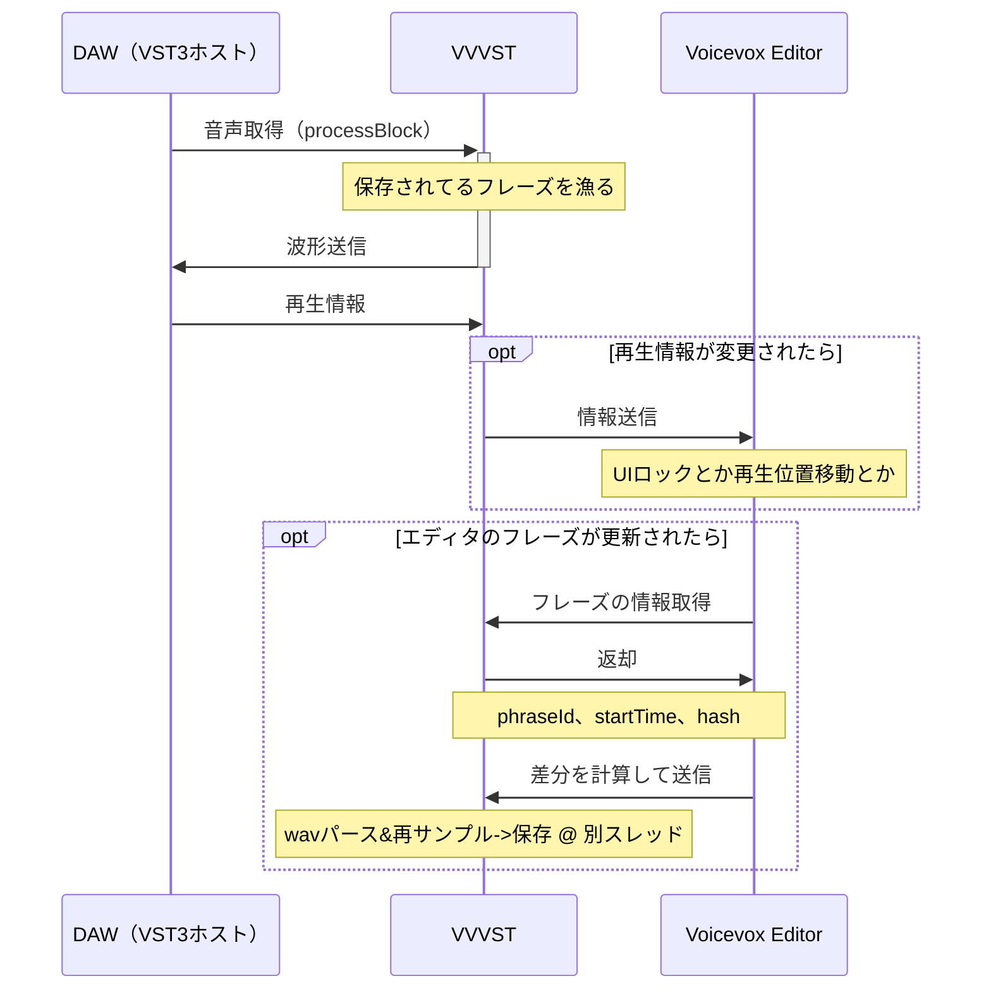

# VVVST

Voicevox の VST プラグイン。

エディタ側：https://github.com/sevenc-nanashi/voicevox/tree/add/vst  
Issue：https://github.com/VOICEVOX/voicevox_project/issues/45

## 開発

- エディタをクローンして`npm run vst:serve`すると VST 用のエディタが立ち上がります
- Release ビルドするときはエディタを`npm run vst:build`すると生成される`voicevox.zip`を Resources 内に入れてください

## ビルド

### VST プラグイン本体

```bash
# Debug
cmake -S . -B build -DCMAKE_BUILD_TYPE=Debug
cmake --build build --config Debug

# Release
cmake -S . -B build -DCMAKE_BUILD_TYPE=Release
cmake --build build --config Release
```

### ライセンス情報（`./Assets/licenses.json`）

依存：
- Ruby（3.2 で動作確認）

```bash
rake license
```

### Windows用インストーラー

依存：
- Ruby（3.2 で動作確認）
- [NSIS](https://nsis.sourceforge.io/Main_Page)（3.09 で動作確認）

```bash
rake installer
```

## ライセンス表記

```md
# COx2/audio-plugin-web-ui

Copyright (c) 2023 Tatsuya Shiozawa
Released under the MIT License
https://github.com/COx2/audio-plugin-web-ui/blob/main/LICENSE
```

## 仕組み


